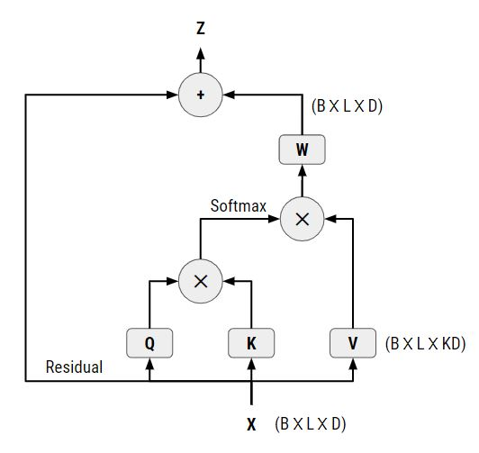

# NLP-CNN-GPT
This repository contains my implementation of a CNN module with Attention Mechanism for NLP's GPT model architecture. This idea is not new and has been suggested in [this article](https://arxiv.org/abs/1711.07971), and has been modified for NLP text generation models. Different from the [Primer](https://arxiv.org/abs/2109.08668) model, this model applies self-attention to the CNN inputs extracted via the `tf.image.extract_patches` function in Tensorflow 2 or the `torch.nn.Unfold` function in PyTorch.



Fig. 1: The CNN Self-Attention Mechanism

The Q, K and V operators consists of 2 operations: (i) a linear/dense layer with weights of dimension `D` by `D`, and (ii) extracting the input of the CNN sliding window resulting in an output of dimension `B` by `L` by `KD` where `K` is the kernel size of the CNN window. These Q, K and V outputs are then split into `H` heads and sent into the standard dot product attention mechansism to generate the attention outputs of dimension `B` by `H` by `L` by `KD/H`. The final output combines the outputs of the different heads and applies a linear/dense layer `W` of dimension `KL` by `D` to ensure that the CNN attention output is of the same dimension `B` by `L` by `D` as the original input.

## Training the Model
To train the model, run the script
```
python train_movie_dialog_sw_tf_cnn_gpt.py
```
